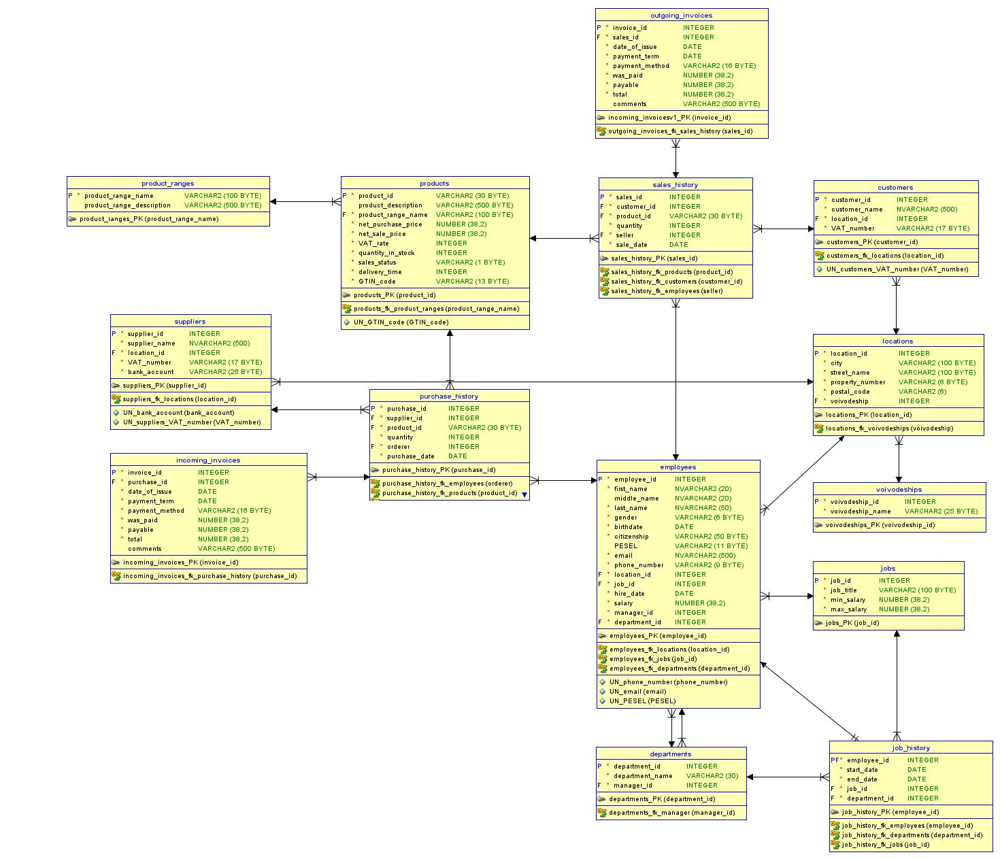
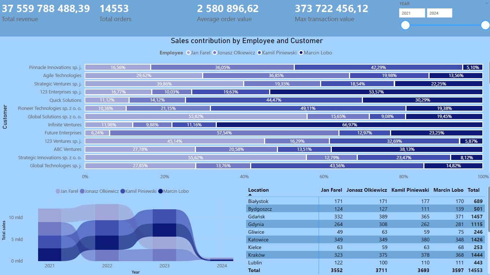
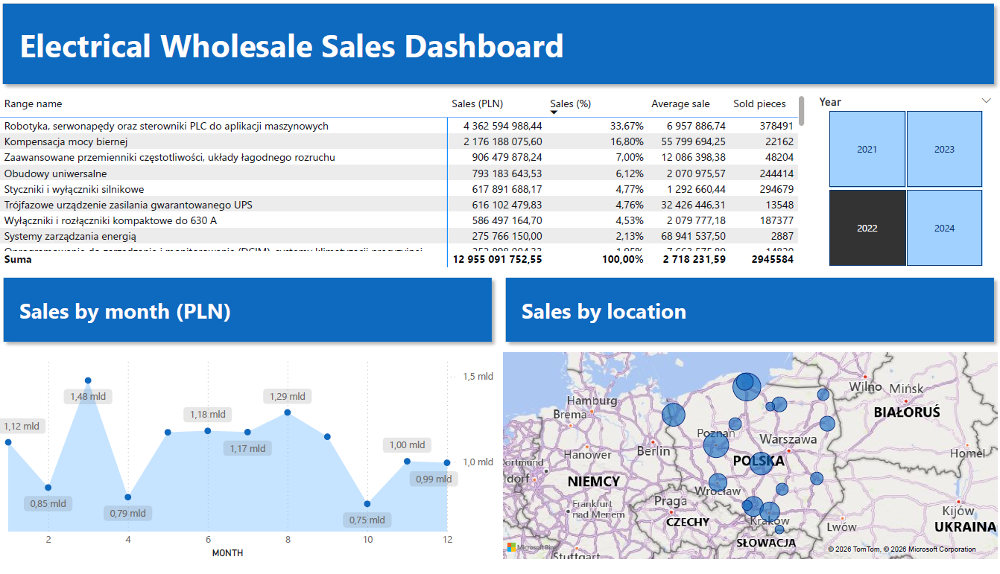
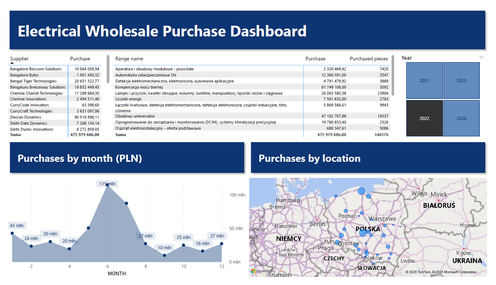

# Electrical Wholesale Sales Analysis

## Project Overview
This project presents an end-to-end data analysis workflow for an electrical wholesale company.

It covers:
- database design and data modeling (Oracle SQL)
- data extraction and transformation (SQL)
- data analysis (Excel)
- interactive dashboard creation (Power BI)

The goal of the project was to analyze sales performance, identify trends and support business decision-making.

---

## Key Insights

- Sales are concentrated in selected regions, indicating geographic revenue clusters  
- Significant variation in monthly sales suggests seasonality  
- A small group of products generates the majority of revenue (Pareto effect)  
- Employee contribution to sales differs across customers

 Analysis with business questions and SQL-based answers is available here:  
 📄 [View report](data_analysis_for_an_electrical_warehouse.docx)

---

## Business Value

The analysis enables:
- identification of top-performing regions and products
- detection of seasonal sales patterns
- evaluation of employee performance
- support for data-driven sales strategy decisions

---

## Tools & Technologies

- SQL Developer Data Modeler (data model)
- Oracle SQL Developer (SQL queries)
- Microsoft Excel (Pivot Tables, Power Query)
- Power BI (data visualization, dashboarding)

---

## Project Structure

/excel → data analysis files   
/images → dashboard screenshots  
/powerbi → Power BI report (.pbix)    
/sql → SQL scripts and queries     

---

## Data Model (ERD)
The diagram below shows the initial structure of the database. Some tables and relationships were later updated during the project, but this gives a clear overview of the main entities and relationships.

Notes:
- This ERD reflects the early design of the database used for SQL analysis and reporting.
- Some changes were made after this diagram, including updates to tables like sales_history, products, and purchase_history.
- Despite updates, the diagram illustrates the core structure, relationships, and logic of the data model.

---

## Dashboard Preview

### Sales Contribution Analysis by Employee and Customer

This dashboard focuses on analyzing the contribution of employees and customers to overall sales performance.

It presents how revenue is distributed across different employees and key customers, allowing for comparison of performance and identification of top contributors.

The dashboard supports evaluation of sales effectiveness, customer importance, and potential areas for optimization in sales strategy.

### Sales Performance Overview Dashboard

This dashboard provides a high-level overview of sales performance across multiple dimensions.

It includes key KPIs such as total sales, average sale and percentage share of sales. The dashboard enables analysis of monthly sales trends, geographic distribution of revenue, and product category performance.

It allows users to quickly identify sales patterns, regional differences, and key revenue drivers.

### Procurement & Purchase Analysis Dashboard

This dashboard provides a comprehensive analysis of purchasing and procurement performance.

It includes key metrics related to total purchase value, supplier contribution, and purchased quantities. The dashboard enables analysis of monthly purchasing trends, geographic distribution of purchases, and supplier-level performance.

It allows identification of key suppliers, monitoring of purchasing patterns, and supports optimization of procurement strategies and cost management.

All of these dashboards provide a comprehensive view of both the revenue and cost sides of the business, supporting data-driven decision-making at various levels of the organization.
